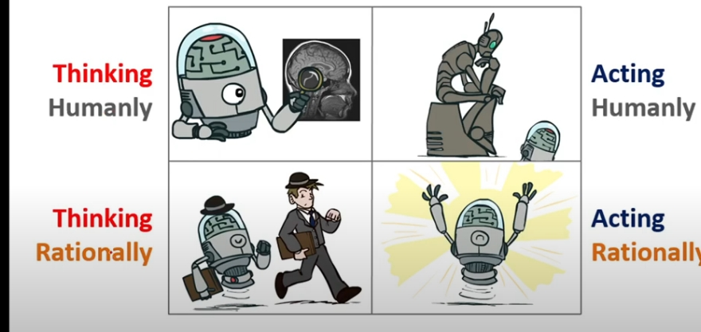
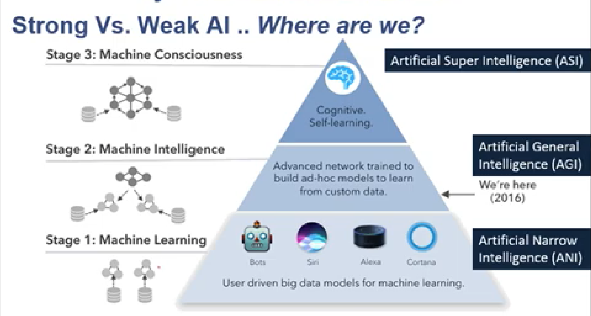
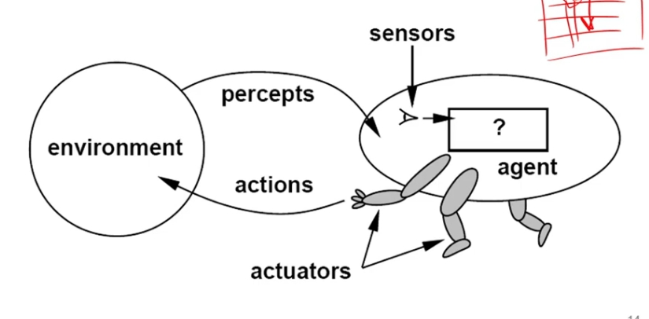
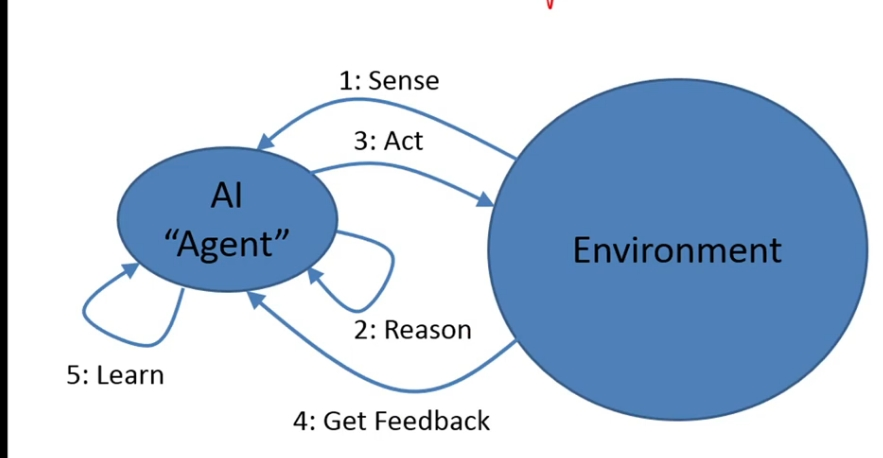
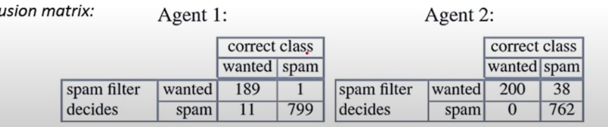
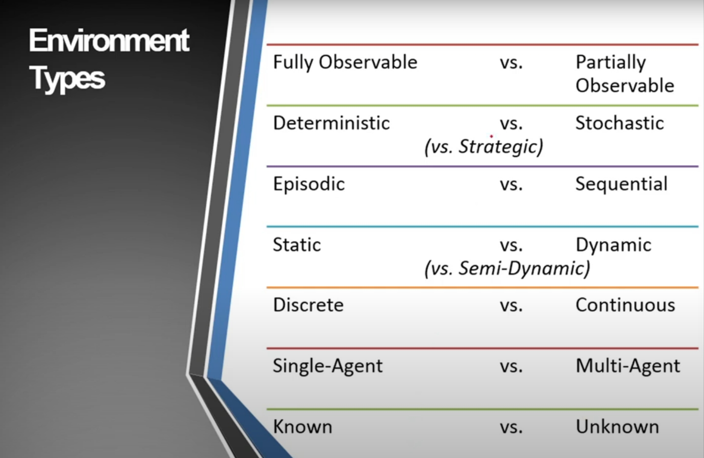
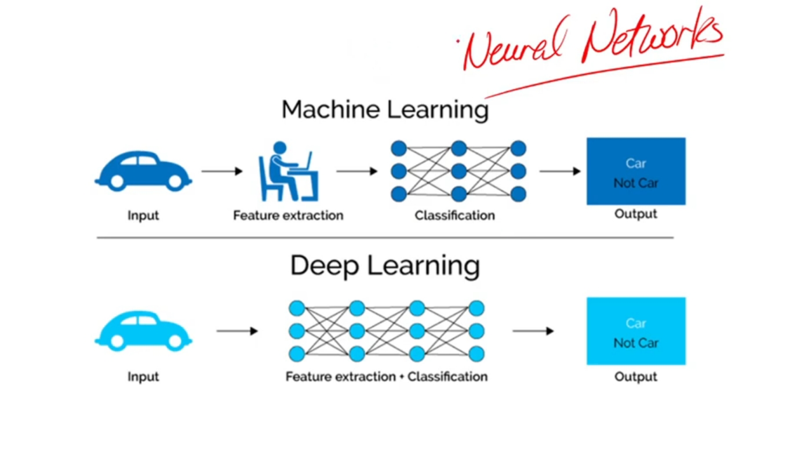
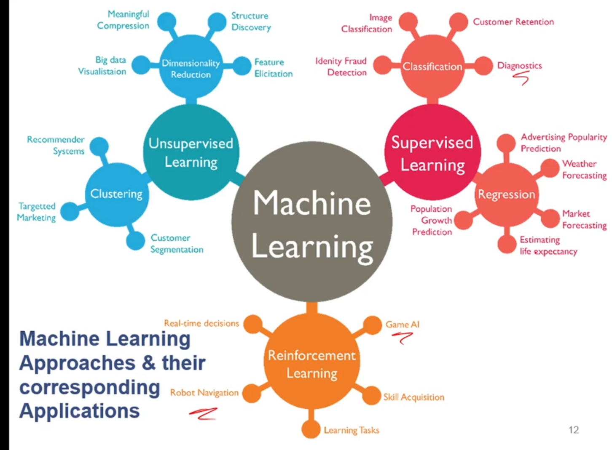
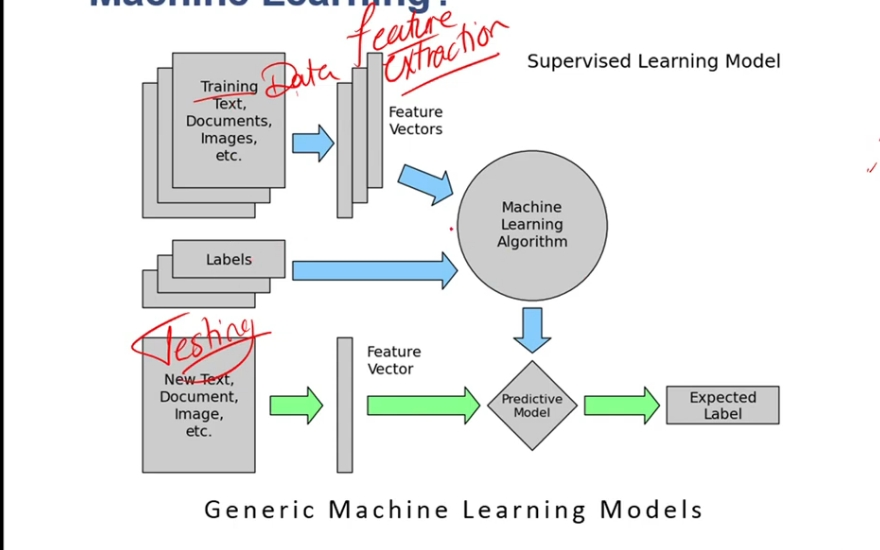
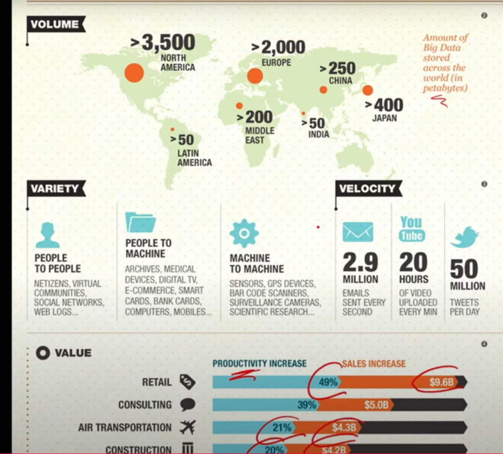

# Introduction to Artfitial Intelligence :

### what is the Intelligence?

it is the resultant of the process of acquiring information, storing it , retriving and combining and comapring it to use in a new context , in addition to solve problems and think rationally 

### what is the Artfitial Intelligence?

the scince of making machines or computer programs behave as they were intelligent.

### There are many sciences on which artificial intelligence is based:
- economics : like decision theory or game theory 
- mathematics : to know what can be computed , valid conclusions depends on logical thinking and rules, probability : to deal with uncertain information 
- computer engineering : to make efficient computers
- linguistics:  how can we understand languages
- philosophy: how does the mind depend on the physical brain , how can a rules used to get a valid conclusion 

### four main approaches ai follows:

`act humanlly`: the study of how make computers do things people are better now

`think humanlly` : he study of automiate the activities or the steps and the algorithms the people follow to make desisions ,solve problems ,learning, ... 

`think rationally `: the study of the mental thinking .

`act rationally`: the study of the design of intillegent agents to achieve a specific goal
___
## systems that act like humans:

the study of how make computers do things people are better now

tuning test or imitaion game: 
we(human interrorgator) will take response to a specific qustions from ai system and human and we will determine that the system is intelligent if we can't determine that this response comes from ai or human otherwise system is not intelligent

the ai system should have many properties(ai fields) like sophia or babyx:

- natural language process (understanding and generating)
- knowlage representation and storing
- automaed reasoning 
- machine learing

also the ai should includes physical behavior by
- computer vision:  extract, analyze, and understand information from images or videos to identify objects, people, activities
- robotics : to move and manupilate with objects
- reinforcement learing: it is a machine learning training method based on positive and negative feedback
- Affective computing : make the sysyem process and simulate human effects (feelings, emotions, mood)

a man called searl asks us to imagine The Chinese Room Argument that argues that the Turing Test is not a valid measure of understanding or intelligence 

Searle’s main point is that computers operate purely on syntax (just blind following rules ) without semantics (meaning or understanding and no awarness and cant make desisions)

so he said that there is 
1. `weak ai:` we can only simulate human intelligence in computers 
2. `strong ai`: we can create algorithms that are considered intellegent (self awarness, free-will, consciousness) and that is impossible 

He claims the Turing Test only demonstrates Weak AI 

___
## systems that act rationally:
what is intelligent agent :
 systens that perceives the environment and take actions to acheive a specific goals for limited resources 
 it is flexible to the changing of the environment and the goals , it learns from exprience 
 can have physical appperance like robots or interface like anything else (chat gbt)

 so the `rational agent` also achieve the goals but obtimally(maximize goal acheivement), so the rational agent should maximize the performance measure 

 

`so what does the agent need to perceives the environment:`
- natural language understanding
- computer vision
- machine learning to learn from the experience 
- knolwlage representation(store goals, past ecperience, observations)
  
 `so what does the agent need to take actions :`

- reasoning and decision theory to take actions 
- natural language generation
- robotics
___

### specifing the environment by `PEAS`                                          
performance measure, environment, actuators, sensors                             

p : a function the agent is maximizing the goal or minimizing the error                                  
E: formal representation for world states                                            
A: actions that change the state according to `transition model`                                              
s: observations that allow the agent to infer the world state.                                               

___
### two types of the agents:                       

- `goal based agent `:                                  
The action depends on the goal only without cost                          
ex: robot take a specific action when he goes right and take another acton when he goes left

- `cost based agents`:                               
the goal is to minimizing the cost of the false desisions (error) 

althoug the error in the first agent is 12 and the second agent is 38 but but the errors from agent 1 are severer so we will choose agent 2 to minimize the cost of the error
 also as automatic deteiction for cancer we have 2 types of errors false- ,false+  , here we need to minimize false- because it is severer

___
### types of environment:

1. fully obsevable vs. partially obsevable                                          
do the agent know all of the data he need, can access to the complete state of the environment?

2. deterministic vs. stochastic vs. strategic                                  
   deterministic: the next state is fully determined by the agent action and the current state only like xo game                                         
   stochastic: includes some of randomness and uncertainty of the next state even if the actions are the same like dice rolls                                                         
   strategic: deterministic but involves the actions of the other agents which can impact the outcome like poker

3. Eposodic vs. sequential:                                
is the agent actionss divided into unconnected single actions like spam filter or it is seuqunce of dependent actions like pachman  

4. stativ vs. dynamic:                                                 
   is the environment changes while the agent is thinking? static like cupe , dynamic like snake game                       
   semi-dynamic: the environment is static but the goals or the constraint changes like pazzle with time

5. discrete vs. continous:                                              
   does the environment have a finite number of distincit percepts , actions and time steps or not
   discrete like chess, continous like Robot Arm Movement

6. known vs. unknown :                                 
   are the rules of the environment known to the agent or not

___
`what is the learning agents:  `                              
agents have the capability of changing themselves by designing algorithms which make machines learn from the data, given training examples or reinforcement learning to improve the performance measure and that called machine learning (subfiled of the ai)

but the `deep learning`: is subfield of machine learning based on neural networks to model complex patterns in large datasets and the feature extraction phase is merged with the classification model                            

there are many approaches the machine learning depends on like supervised, unsupervised, reinforcement,nueral networks and each approah has its algorithms and its applicatons   

`supervised:`   
the model is trained on a labeled dataset, meaning each input is paired with the correct output.                                              

machine learning differs from data-mining that machine learning focus on predecting while data-mining focus on dicovery of the unknown properties and the relations is the data in the category of unsupervised
___
`Data science :  `                                     
the science which uses statistics, computer science, machine learning, visualization to collect, clean, integrate, visualize and interact with data to create product.                                     

why Data science?                                      
there are many question which we can't answer without collecting data and data analysis like does smoking lead to lung-cancer means that solutions deduced from data not theory(deductive) and because we became have big data 

to understand big data => 5v
(volume, velocity, variety => veracity) => value 

